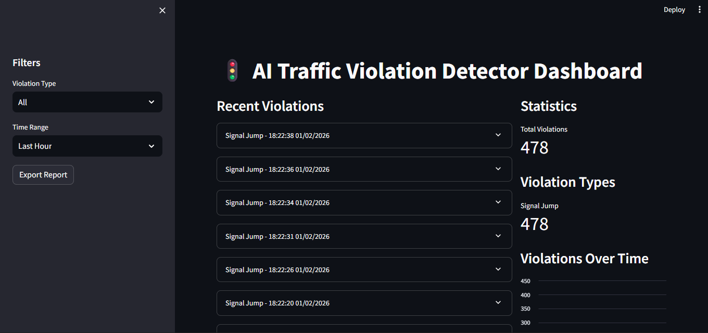
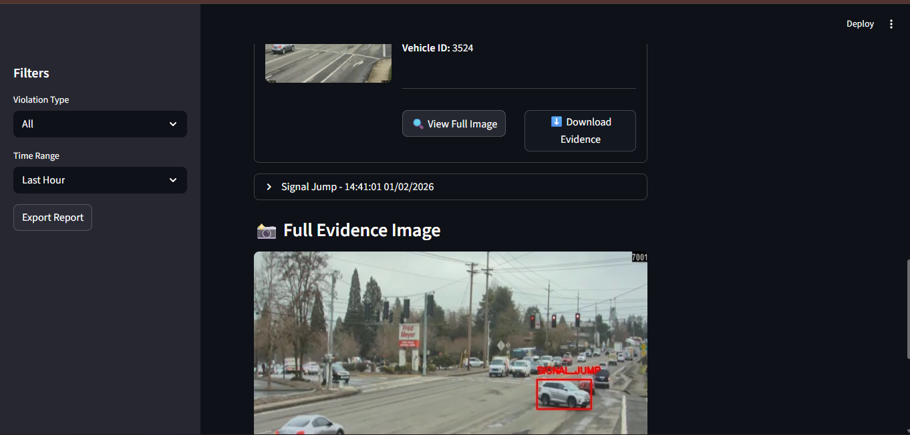
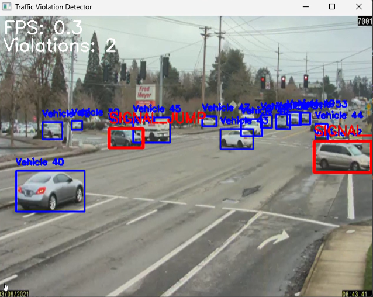

---
#🚦 **AI Traffic Violation Detector**

An **AI-based Traffic Violation Detection System** that uses **Computer Vision and Deep Learning** to automatically detect traffic rule violations from video streams and present them through an interactive **Streamlit dashboard** with visual evidence.

---

## 📌 Project Overview

A computer-vision–based traffic monitoring system designed to detect and manage traffic violations in real time using deep learning and object tracking.
The system analyzes live video feeds, detects traffic violations, tracks vehicles across frames, and records violations with timestamped evidence.

A Streamlit-based dashboard is provided to review violations, visualize statistics, and export reports.

---

## 🎯 Key Features

- Real-time traffic violation detection
- YOLOv8-based object detection
- DeepSORT-based object tracking
- Multiple traffic violation detection
- Automated evidence generation
- Privacy-aware design (face blurring)
- Interactive Streamlit dashboard
- Near real-time performance

---

## 🚨 Traffic Violations Detected

1. Signal Jumping
2. Helmetless Riding
3. Overspeeding
4. Wrong-lane Driving
5. Triple Riding

---

## 🧠 System Architecture

```
Video Input (CCTV / Webcam / Video File)
        ↓
YOLOv8 Object Detection
        ↓
DeepSORT Object Tracking
        ↓
Violation Detection Logic
        ↓
Evidence Generation (Images & Clips)
        ↓
Streamlit Dashboard
```

---

## 🛠️ Technologies Used

- Python 3.8+
- OpenCV
- Ultralytics YOLOv8
- DeepSORT
- Streamlit
- NumPy
- Pandas
- Pillow
- Tesseract OCR (optional)

---

## 📂 Project Structure

```
AI-Traffic-Violation-Detector/
│
├── config.py                # Global configuration settings
├── detection.py             # YOLOv8-based object detection logic
├── tracking.py              # DeepSORT-based vehicle & rider tracking
├── violations.py            # Traffic violation detection rules
├── evidence.py              # Evidence generation & management
├── main.py                  # Main application for live/video detection
├── dashboard.py             # Streamlit dashboard for visualization
├── requirements.txt         # Python dependencies
├── README.md                # Project documentation
├── .gitignore               # Git ignore rules
│
├── models/                  # Pre-trained deep learning models
│   └── yolov8n.pt            # YOLOv8 Nano weights
│
├── screenshots/             # Documentation screenshots (README)
│   ├── dashboard_overview.png
│   ├── violation_details.png
│   └── live_detection.png
│
├── evidence/                # Generated runtime evidence
│   ├── images/              # Captured violation images
│   └── clips/               # Video clips of violations
│
└── logs/                    # Application logs
    └── traffic_detector.log

```

---

## ⚙️ Installation

```bash
git clone https://github.com/mekalakarthik05/AI-Traffic-Violation-Detector.git
cd AI-Traffic-Violation-Detector
python -m venv venv
```

Activate the virtual environment:

```bash
# Windows
venv\Scripts\activate

# Linux / macOS
source venv/bin/activate
```

Install dependencies:

```bash
pip install -r requirements.txt
```

---

## ▶️ Usage

### Run the Detector

```bash
python main.py
```

To run with a video file:

```python
from main import TrafficViolationDetector
detector = TrafficViolationDetector()
detector.run_live_detection("path/to/video.mp4")
```

---

### Run the Dashboard

```bash
streamlit run dashboard.py
```

Open in browser:

```
http://localhost:8501
```

---

## 📊 Dashboard Capabilities

- Evidence image preview
- Inline full-image expansion
- Violation metadata display
- Filters and statistics
- CSV report export

---

📸 Screenshots

### 🖥️ Dashboard Overview


### 🚦 Violation Details


### 🎥 Live Detection


---

## 🔐 Privacy & Evidence Design

- Metadata is not embedded directly on evidence images
- Evidence and details are shown separately
- Designed to preserve evidentiary clarity
- Privacy-first approach with optional face blurring

---

## 📈 Future Enhancements

- Advanced helmet detection
- Lane detection and traffic light recognition
- Automatic number plate recognition (ANPR)
- Cloud-based analytics
- Mobile application integration

---

## 🎓 Academic Disclaimer

This project is intended strictly for academic and research purposes.
Ensure compliance with local laws and privacy regulations before deployment.


